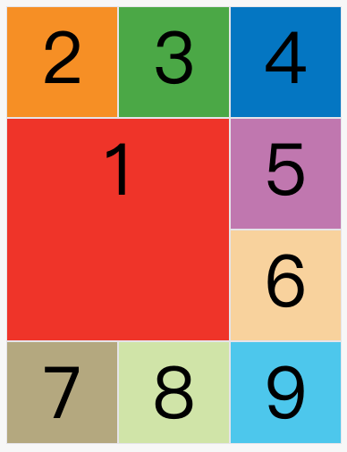

## Flex 布局

## Grid 布局

`Grid`是CSS3和HTML5引入的新现代布局形式，也是**响应式的、最强大的布局形式**，更重要的是，现代浏览器**内置**了对`Grid`的支持。

相对于`Flex`只能对横轴或纵轴进行一维布局，`Grid`允许你对行和列进行二维布局操作，就像单元格一样。换句话说，用`Flex`能实现的复杂布局，用`Grid`可以更简单地实现，还更具响应性（responsive）。

> 参考资料：
>
> - [CSS Grid 网格布局教程 - 阮一峰的网络日志 (ruanyifeng.com)](https://www.ruanyifeng.com/blog/2019/03/grid-layout-tutorial.html)
> - 

### 基本概念

`Grid` 布局利用网格对项目（item）进行定位，具体来说就是将**容器（container）**划分成**"行"（row，一段水平区域）**和**"列"（column，一段竖直区域）**，行与列交叉的区域就是**单元格（cell）**，如下图所示：


其中划分网格（单元格）的边界线被称为**“网格线”（grid line）**，如下图所示，`Grid`不仅能控制单元格样式，网格线也可以被单独地引用并赋予样式。


### 使用`Grid`

对一个块级元素赋予 `display: grid` 来把它变成 **Grid 容器**，其子元素默认都是块级元素，若想要指定为行内元素也可以使用 `display: inline-grid`。

**和`Flex`不同，激活`Grid`布局后会立刻改变页面样式，把内部元素填入单元格内。**

#### 指定行和列的大小和数量

可以使用`grid-template-rows`和`grid-template-columns`来指定每一行和每一列的宽度或高度，给每个单元格设置一个pattern。

- 传统长度单位，如`px`和百分比，可以用于模板，例：`grid-template-columns: 100px 30% 30%;`
- `repeat(times, value)`函数可以用于快速填写重复值，例：`grid-template-rows: repeat(3, 33.33%);`
- `auto-fill`关键字可以用在`repeat`函数中的`times`参数中，表明**容器（container）**的大小不确定（不知道能重复多少次），但**希望尽量多地容纳元素（item）**，例：`repeat(auto-fill, 100px);`

- `fr`关键字（fraction）用来表示比例，类似于`flex`关键字，也**可以与绝对长度单位结合使用**（二者会独立计算）。例：`grid-template-columns: 1fr 1fr;`就会生成两个等宽的列
- `minmax(min, max)`函数指定了一个长度范围，可以用于`repeat`函数的`value`参数
- `auto`关键字表示浏览器根据内部元素大小自动决定长度
- 在指定行列时还可以使用方括号语法如`[grid-line]`来**指定网格线的名字**，一条线可以有多个名字。例：`grid-template-columns: [c1 col1] 100px [c2] 100px [c3] auto [c4];`

#### 指定行和列的间距

可以使用`(grid-)column-gap`和`(grid-)row-gap`来指定行和列之间的距离；`(grid-)gap`是二者合并的简写形式，**前一个是行间距，后一个是列间距**。

> 之所以打括号是因为新版本中`grid-`前缀已经被省略

#### 指定项目（item）所在单元格

使用`grid-[column/row]-[start/end]`属性可以指定项目所在的单元格，不仅可以指定位置，还可以指定大小，比如指定某个元素占据第2行第1列到第3行第2列的所有单元格。



如下列代码就可以绘制出上面的布局：

```css
.item-1 {
  grid-column-start: 1;
  grid-column-end: 3;
  grid-row-start: 2;
  grid-row-end: 4;
}
```

对于没有被指定位置的项目，则由浏览器根据`grid-auto-flow`属性来决定放在哪个单元格，并绕过已经排好的单元格。

还可以使用`grid-[column/row]: <start> / <end>`或`grid-area: <row-start> / <column-start> / <row-end> / <column-end>;`来合并这些属性。

#### 其他属性

- `grid-auto-flow`属性指定了子元素的填充顺序
  - `row`：默认值，先行后列
  - `column`：先列后行
  - `[dense]`：在遵循上述规则的基础下，尽量不留空（可能会填入前面的空位）
- `[justify/align/place]-items`属性指定了**所有单元格内元素**的排布
  - justify 指定了单元格内容的**水平**布局
  - align 指定了单元格内容的**垂直**布局
  - place 是上面二者的合并简写形式，**前一个是 align（垂直），后一个是 justify（水平）**
- `[justify/align/place]-content`属性指定了**所有单元格（整个内容区域）在容器内**的排布
- `[justify/align/place]-self`属性**用于某个项目**，指定**某个单元格内的元素排布**
- `grid-auto-[columns/rows]`属性**指定了`template`外自动生成的行或列的长度**

