## 常见考点

### HTTP 状态码

- 信息响应 (100–199)
  - `100` - Continue：多用于 `POST` 请求先发送 HEADER 部分，服务器会响应 `100 - Continue` 让客户端继续发送 BODY 部分
- 成功响应 (200–299)
  - `200` - OK
- 重定向消息 (300–399)
- 客户端错误响应 (400–499)
  - `400 ` - Bad Request：由于被认为是客户端错误（例如，错误的请求语法、无效的请求消息帧或欺骗性的请求路由），服务器无法或不会处理请求。
  - `403` - Forbidden：客户端没有访问内容的权限；也就是说，它是未经授权的，因此服务器拒绝提供请求的资源。与 `401 Unauthorized` 不同，服务器知道客户端的身份。
  - `404` - Not Found：服务器找不到请求的资源。在浏览器中，这意味着无法识别 URL。在 API 中，这也可能意味着端点有效，但资源本身不存在。服务器也可以发送此响应，而不是 `403 Forbidden`，以向未经授权的客户端隐藏资源的存在。这个响应代码可能是最广为人知的，因为它经常出现在网络上。
- 服务端错误响应 (500–599)

### TCP 三次握手与四次挥手

#### 三次握手

前提条件：TCP服务器进程先创建传输控制块TCB，时刻准备接受客户进程的连接请求，此时**服务器就进入了LISTEN（监听）状态**；

1. **TCP客户进程**也是先创建传输控制块TCB，然后**向服务器发出连接请求报文**，这是报文首部中的同部位SYN=1，同时选择一个初始序列号 seq=x ，此时，TCP客户端进程进入了 SYN-SENT（同步已发送状态）状态。TCP规定，SYN报文段（SYN=1的报文段）不能携带数据，但需要消耗掉一个序号。
2. **TCP服务器**收到请求报文后，如果同意连接，则**发出确认报文**。确认报文中应该 ACK=1，SYN=1，确认号是ack=x+1，同时也要为自己初始化一个序列号 seq=y，此时，TCP服务器进程进入了SYN-RCVD（同步收到）状态。这个报文也不能携带数据，但是同样要消耗一个序号。
3. **TCP客户进程**收到确认后，还要**向服务器给出确认**。确认报文的ACK=1，ack=y+1，自己的序列号seq=x+1，此时，TCP连接建立，**客户端进入ESTABLISHED（已建立连接）状态**。TCP规定，**ACK报文段可以携带数据，但是如果不携带数据则不消耗序号**。
4. 当服务器收到客户端的确认后也进入ESTABLISHED状态，此后双方就可以开始通信了。

**Q：为什么是三次握手？两次不行吗？**

> 两次握手会省略最后一次客户端重复发送的确认请求，表示服务端**收到一个报文就建立连接状态**，这可能导致一些问题：
>
> - 假如客户端发送了第一个请求连接并且没有丢失，只是因为在网络结点中滞留的时间太长了，客户端会自动重传该报文，这样服务器就会收到两份报文且建立两份连接，导致不必要的错误和资源的浪费。
> - 如果发生了服务端回传的ACK报文发生了丢包，会导致服务端建立连接但客户端未建立连接，服务端发送的报文将被丢弃

#### 四次挥手

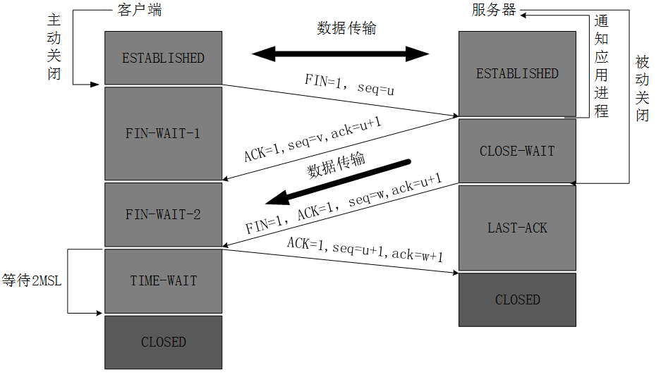

1. **客户端进程发出连接释放报文**，并且停止发送数据。释放数据报文首部，FIN=1，其序列号为seq=u（等于前面已经传送过来的数据的最后一个字节的序号加1），此时，客户端进入FIN-WAIT-1（终止等待1）状态。 TCP规定，FIN报文段即使不携带数据，也要消耗一个序号。
2. **服务器收到连接释放报文，发出确认报文**，ACK=1，ack=u+1，并且带上自己的序列号seq=v，此时，服务端就进入了CLOSE-WAIT（关闭等待）状态。TCP服务器通知高层的应用进程，客户端向服务器的方向就释放了，**这时候处于半关闭状态，即客户端已经没有数据要发送了**，但是服务器若发送数据，客户端依然要接受。这个状态还要持续一段时间，也就是整个CLOSE-WAIT状态持续的时间。
3. **客户端收到服务器的确认请求**后，此时，**客户端就进入FIN-WAIT-2（终止等待2）状态**，等待服务器发送连接释放报文（在这之前还需要接受服务器发送的最后的数据）。
4. **服务器**将最后的数据发送完毕后，就**向客户端发送连接释放报文**，FIN=1，ack=u+1，由于在半关闭状态，服务器很可能又发送了一些数据，假定此时的序列号为seq=w，此时，**服务器就进入了LAST-ACK（最后确认）状态**，等待客户端的确认。
5. **客户端收到服务器的连接释放报文后，必须发出确认**，ACK=1，ack=w+1，而自己的序列号是seq=u+1，此时，客户端就进入了TIME-WAIT（时间等待）状态。**注意此时TCP连接还没有释放**，必须经过 2xMSL （最长报文段寿命）的时间后，**当客户端撤销相应的TCB后，才进入CLOSED状态**。
6. **服务器只要收到了客户端发出的确认，立即进入CLOSED状态**。同样，撤销TCB后，就结束了这次的TCP连接。可以看到，服务器结束TCP连接的时间要比客户端早一些。

**Q：为什么握手只需要三次，而挥手需要四次？**

> 因为必须要确定双方都没有报文要发送时才能关闭连接，因此必须要 (FIN+ACK)x2=4 份报文。

**Q：为什么客户端发出第四次挥手的确认报文后要等2MSL的时间才能释放TCP连接？**

> 如果第四次挥手的报文丢失，服务端没收到确认ack报文就会重发第三次挥手的报文，这样报文一去一回最长时间就是2MSL，所以需要等这么长时间来确认服务端确实已经收到了。

### 浏览器中的 Session 和 Cookie

由于 HTTP 是无状态协议，即不维护连接的历史信息，你就算连续发送两条报文它也不会连着处理，和分开发也没有任何区别，这在处理一般网页请求时自然没有什么问题，但在涉及一些连续操作如账号管理、购物车等场景时就显得有些力不从心。这时，就需要引入 `cookie` 来记录状态信息。

**cookie** 是客户端保存用户信息的一种机制，将服务器发送到浏览器的数据保存在本地（放在 `document.cookie` 中），下次向同一服务器再发起请求时被携带发送（报文首部里的 `With-Credential` 字段）。主要用于以下场景：

- 会话状态管理(如用户登录状态、购物车、游戏分数或其它需要记录的信息)
- 个性化设置(如用户自定义设置、主题等)
- 浏览器行为跟踪(如跟踪分析用户行为等)

#### 引入 Session

由于 cookie 都是明文存储在 `document.cookie` 属性中的（如下图所示），就不能避免被篡改带来的安全风险，这时我们就需要引入 **Session**。

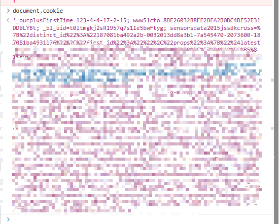

**Session** 代表服务器和客户端一次会话的过程，是一种持久网络协议，在用户(或用户代理)端和服务器端之间创建关联，从而起到交换数据包的作用机制。对照Cookie，Session是一种在服务器端保存数据的机制，用来跟踪用户状态的数据结构，可以保存在文件、数据库或者集群中。

也就是说，我们不仅要在客户端存储连接信息，在服务端也要存一份（注意这和 HTTP 的无状态并没有什么关系）。

只要是来自同一用户的请求都在同一个 Session 中处理，这样，当用户在应用程序的 Web 页之间跳转时，存储在 Session 对象中的变量将不会丢失，而是在整个用户会话中一直存在下去。

当客户端关闭会话，或者 Session 超时失效时会话结束。

除此之外，Session还有更自由的存储结构，不必受 cookie 的格式、大小限制。

> 目前大多数的应用都是用Cookie结合SessionId实现跟踪的。第一次创建Session时，服务端会通过在HTTP协议中返回给客户端，在Cookie中记录SessionID，后续请求时传递SessionID给服务，以便后续每次请求时都可分辨你是谁。
>
> 为了防止sessionId被修改，还需要附上一些额外的加密信息如时间戳加密。

#### 禁用 Cookie 的解决方案

- 拼接SessionId参数：在GET或POST请求中拼接SessionID，GET请求通常通过URL后面拼接参数来实现，POST请求可以放在Body中。无论哪种形式都需要与服务器获取保持一致。
- 基于Token (令牌)：在APP应用中经常会用到Token来与服务器进行交互。Token本质上就是一个唯一的字符串，登录成功后由服务器返回，标识客户的临时授权，客户端对其进行存储，在后续请求时，通常会将其放在HTTP的Header中传递给服务器，用于服务器验证请求用户的身份

这里对**token**稍微展开说说：

- token本质上就是一个独特的字符串，需要服务端兼容
- **每一次请求都需要携带 token，需要把 token 放到 HTTP 的 Header 里**
- **基于 token 的用户认证是一种服务端无状态的认证方式，服务端不用存放 token 数据。用解析 token 的计算时间换取 session 的存储空间，从而减轻服务器的压力，减少频繁的查询数据库**

#### 同源和跨域

CORS 问题真的是折磨前后端萌新的法宝，我当年就被这玩意儿折磨的不轻。

所谓的“同源”指的是“三个相同”：协议相同、域名相同、端口相同。只有这三个完全相同，才算是同源。

同源策略的目的：是为了保证用户信息的安全，防止恶意的网站窃取数据。

## HTTPS 协议

在传统 HTTP 协议中，所有数据都是明文传输的，包括敏感信息如用户密码等。

有人或许可以说，我可以在前端进行 Hash+Salt 处理不就可以的吗。但是 Hash 算法如 MD5 是取模运算，是不可逆的，因此在服务端如果不能提前知道取模因子就只能直接拿这个加盐后的值作为密码，这就失去了加密的意义（黑客直接拿到这个明文的加密值也可以登录）。

又有人说了，那我提前把这个取模因子当作“密钥”发过去不就好了？但这个密钥也是明文传输的，因此还是逃不开黑客的魔爪。但是，能想到这一层的话，恭喜你已经摸到了 HTTPS 提出者的思路了。

### 加密算法

HTTPS 采用了**混合加密算法**，具体来说就是**对称式加密和非对称式加密混合使用**。

为什么要这么干呢？一句话来说就是为了**兼顾速度和安全性**。

- 对称加密：加密和解密都是使用同一个密钥，常见的对称加密算法有 DES、3DES 和 AES
  - 优点：算法公开、**计算量小、加密速度快、加密效率高**，适合加密比较大的数据
  - 缺点：
    - 无法避免密钥的传输，而密钥在传输过程中无法保证不被截获，因此对称加密的安全性得不到保证
    - 在公网交流所有人都需要在同一网络空间使用唯一密钥，这会引起密钥数量的急剧增长

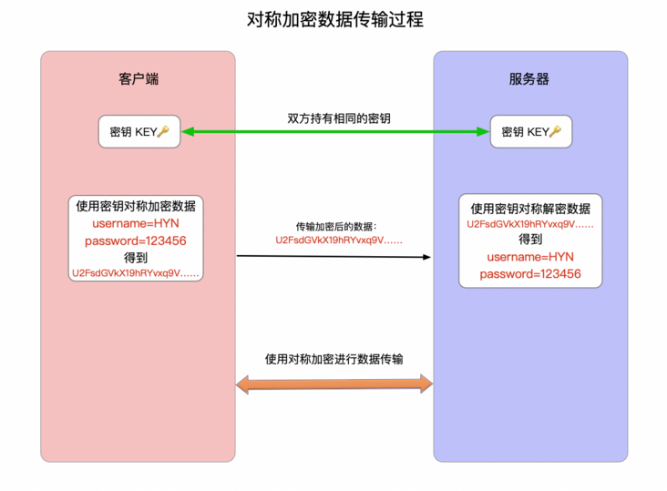

- 非对称加密：加密和解密需要使用两个不同的密钥——公钥（public key）和私钥（private key）
  - 优点：算法公开，加密和解密使用不同的钥匙，私钥不需要通过网络进行传输，安全性很高。
  - 缺点：计算量比较大，加密和解密速度相比对称加密慢很多。

### 实现原理

HTTPS 在 HTTP 的基础上增加了 **SSL (安全套接层) /TLS (安全传输层协议)**，在建立连接前需要**额外的握手协议**，在握手过程中将确立双方加密传输数据的密码信息。

值得注意的是，之所以是**混合加密**，是因为 HTTPS **在内容传输的加密上使用的是对称加密，非对称加密只作用在证书验证阶段**。

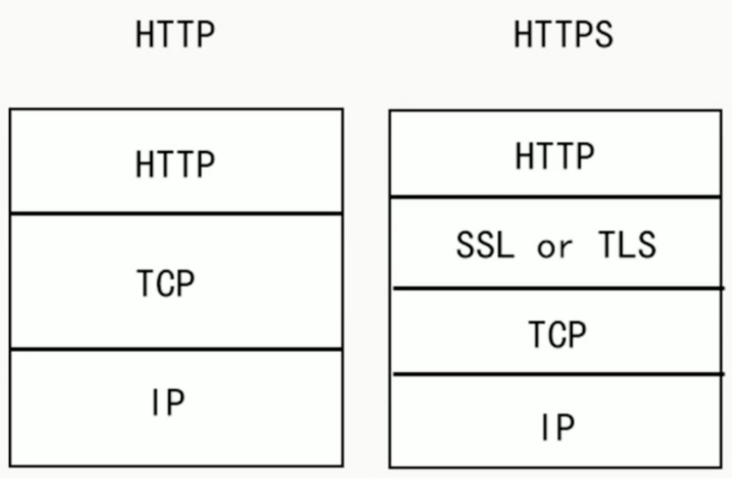

#### SSL 和 TLS

SSL/TLS是一个安全通信框架，上面可以承载HTTP协议或者SMTP/POP3协议等。

> SSL(Secure Socket Layer)安全套接层，是1994年由Netscape公司设计的一套协议，并与1995年发布了3.0版本。
>
> TLS(Transport Layer Security)传输层安全是IETF在SSL3.0基础上设计的协议，**实际上相当于SSL的后续版本**。

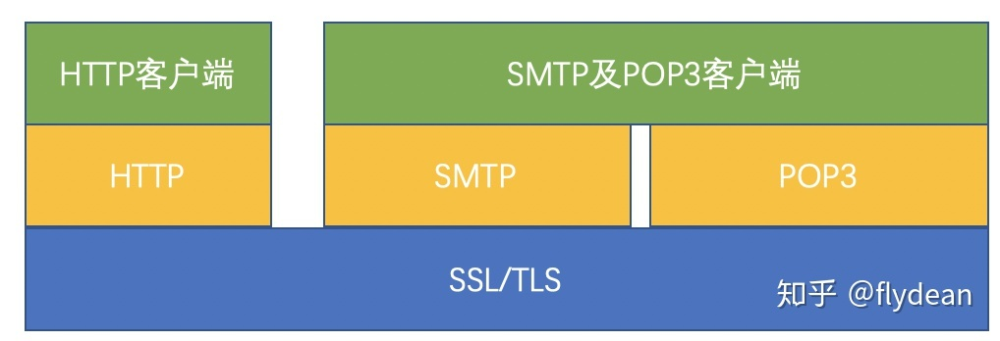

##### TLS 协议

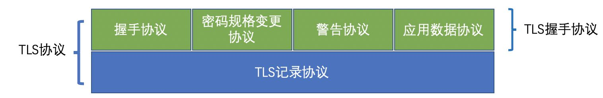

TLS主要分为两层：

- 上层是**TLS握手协议**，主要分为握手协议，密码规格变更协议和应用数据协议4个部分
  - 握手协议：在客户端和服务器端**商定密码算法和共享密钥**，包括**证书认证**，是4个协议中最最复杂的部分
  - 密码规格变更协议：向通信对象传达变更密码方式的信号
  - 警告协议：发生错误的时候将错误传达给对方
  - 应用数据协议：将TLS承载的**应用数据**传达给通信对象的协议
- 下层是TLS记录协议，主要负责使用**对称**密码对消息进行加密

这里对 TLS 的详细实现细节不再叙述。

##### 握手协议

我们把证书原本的内容生成一份“签名”，比对证书内容和签名是否一致就能判别是否被篡改。这就是数字证书的“防伪技术”，这里的“签名”就叫**数字签名**。

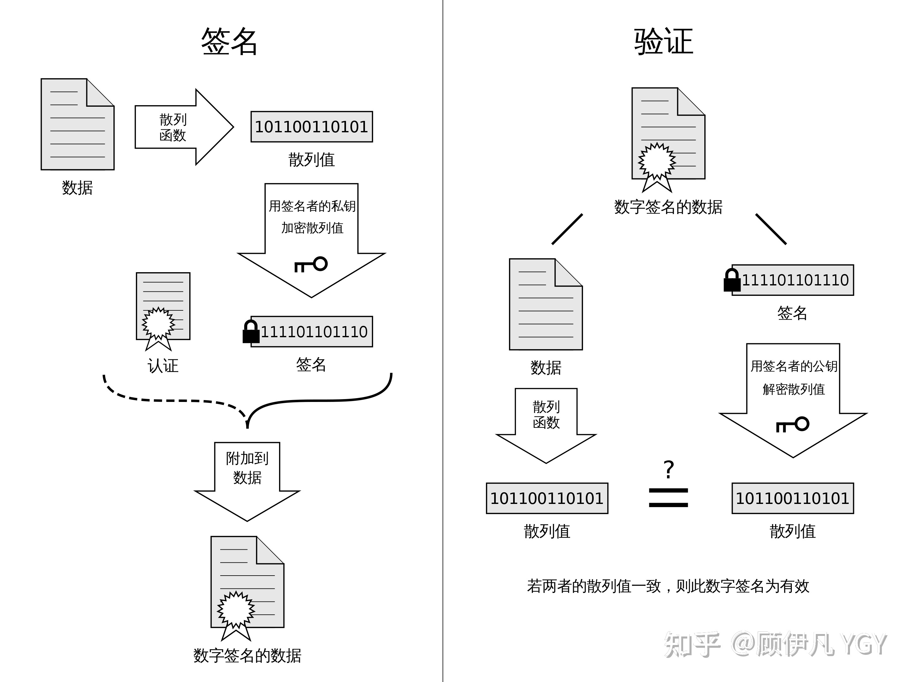

##### SSL 证书

SSL 证书，或者说 SSL/TLS 证书是 HTTPS 握手的关键所在。

- SSL 证书有多种类型，都可以从证书颁发机构处获取
- SSL 证书**一定会过期**，官方规定证书**有效期不得超过 27 个月**

#### 握手步骤

1. 客户端请求 HTTPS 端口 443（不是 HTTP 的 80 端口），将自己支持的一套加密规则发送给网站
2. 服务器从中选出一组加密算法与HASH算法，并**将自己的身份信息以证书的形式发回给浏览器**。证书里面包含了**网站地址，加密公钥，以及证书的颁发机构等信息**
3. 客户端检查服务器的**数字 CA（Certification Authority）证书**
   - 验证证书的合法性（颁发机构、地址是否一致、是否过期等）
   - 如果证书**不是可信机构颁布**，或者证书中的域名与实际域名不一致，或者证书已经过期，就会向访问者显示一个警告，由其选择是否还要继续通信
   - 如果证书受信任，或者是用户接受了不受信的证书，浏览器会生成一串随机数的密码（这是后面对称式加密的密钥），并**用证书中提供的公钥加密**
   - 使用约定好的HASH算法计算握手消息，并使用生成的随机数对消息进行加密，最后将之前生成的所有信息发送给网站
4. 浏览器解密并计算握手消息的HASH，如果与服务端发来的HASH一致，此时握手过程结束，**之后所有的通信数据将由之前浏览器生成的随机密码并利用对称加密算法进行加密**。

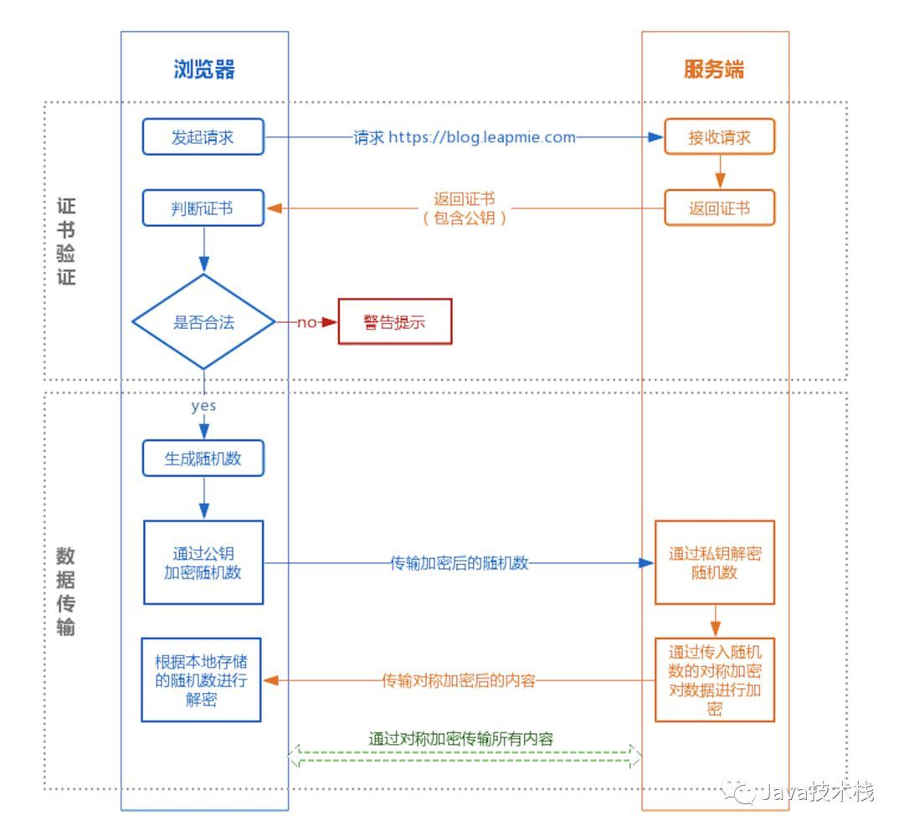

### HTTPS 的漏洞

HTTPS 真的绝对安全吗？显然不是的，毕竟天下没有不透风的墙。举一个简单的例子，如果没有公认的证书颁发机构，我们甚至根本无法确认证书是不是来自我们想要访问的网站！

一些常见的 HTTPS 漏洞如下：

- SSL 劫持：一种典型的中间人攻击，攻击者需要伪造一个SSL证书发给浏览器，但这个时候由于伪造的SSL证书不受信任，浏览器会给出提示，因此需要注意浏览器安全提示

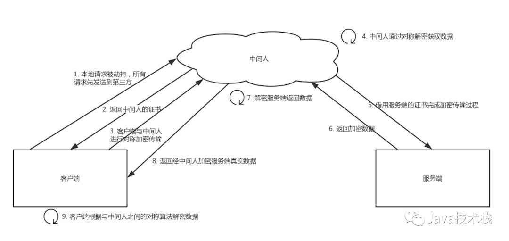

## HTTP 2.0

http2.0 是一种安全高效的下一代 http 传输协议。安全是因为 http2.0 建立在 https 协议的基础上，高效是因为它是通过**二进制分帧**来进行数据传输。

#### 二进制分帧（Binary Format）

HTTP 1.1最大的槽点之一就是使用**明文**对头部进行编码而非二进制，这造成了空间的浪费，毕竟有些一个标志位就能解决的东西非要用几十个字节的字符串来描述，对于寸土寸金的 TCP 报文实在是有些浪费。

除了**二进制**外，**分帧**也是很重要的一个特性 —— **HTTP 2.0把所有传输的信息分割为更小的消息（message），并把消息进一步细分为更小的帧（frame）**，并对它们**采用二进制格式的编码**。

比如， HTTP1.x 的首部信息会被封装到 HEADER frame，而相应的 Request Body 则封装到 DATA frame 里面，具体如下图所示。

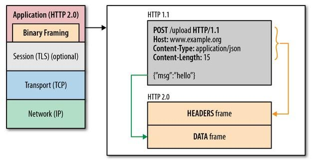

### 多路复用 (Multiplexing) 和连接共享

多路复用对于搞信号的同学来说肯定不陌生，我们先来看看原本的 HTTP 1.x 的 TCP 请求风格吧。

#### HTTP 1.x

**HTTP 1.0** 中是没有连接持久化这个概念，首先根据浏览器的解析顺序，我们不能一次性得到完整的 HTML 页面，而是会遇到资源后再进行新的请求。而在 HTTP 1.0 中，我们**每次请求都需要建立新的 TCP 连接**，重复握手和挥手过程！

**HTTP 1.1** 中引入了持久连接和管道的概念，这样不用每次请求都去重新开启和新建连接，HTTP默认底层的TCP连接是open的，除非手动告诉它要去关闭。在这种情况下，客户端可以使用同一个连接去和server进行交互，从而极大的提升HTTP的效率。

虽然在HTTP1.1中可以使用同一个连接进行数据传输了，但是对于这个连接来说，其中的请求是一一响应的，他们是有顺序的。**如果最前面的请求被阻塞了，后面的请求也得不到响应**。这种情况被称为 **head-of-line (HOL) blocking**。

为了解决这个问题，可以在 client 和 server 端**建立多个连接**，这样就可以利用多个 connection 并行进行数据的传输，从而提升传输效率。

#### HTTP 2

HTTP1.1需要建立多个TCP连接从而解决并行传输的问题，但是在HTTP/2 中**只需要建立一个连接**就够了。

得益于新的**分帧机制**，在这个连接中可以传输多个数据流，每个数据流中又包含多个message包，每个message又被切分为多个数据frame，这些数据帧可以**乱序发送**，并**在接收端根据帧首部信息重新组装**。

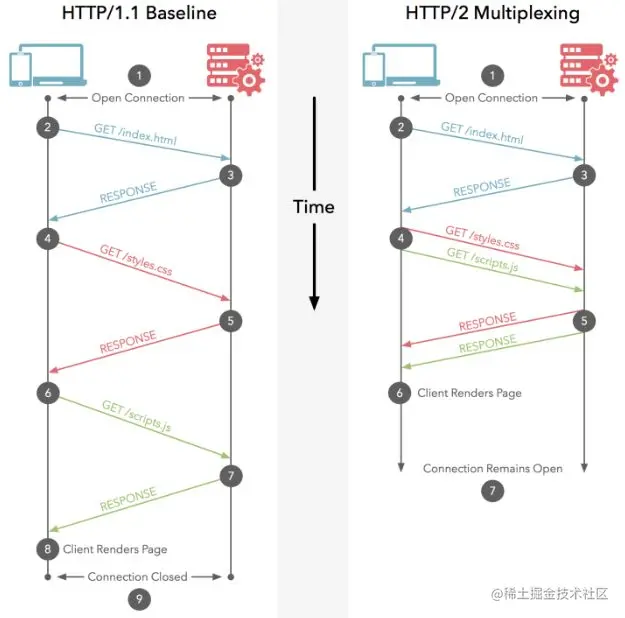

### 头部压缩

http1.x的头带有大量信息，而且每次都要重复发送。http/2使用**本地索引表+映射**机制来减少需要传输的header大小，即双方各自缓存一份头部字段表，在**报文头部只存储字段表的索引**，同时**只在头部更新时传输需要更新的字段**。这样既避免了重复header的传输，又减小了需要传输的大小。

http/2使用的是专门为首部压缩而设计的HPACK②算法，**使用一份索引表来定义常用的http Header**，把常用的 http Header 存放在表里，请求的时候便只需要发送在表里的索引位置即可。

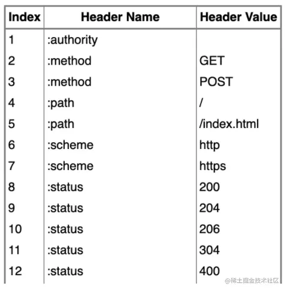

### 其他特征

#### 请求优先级（Request Priorities）

把http消息分为很多独立帧之后，就可以通过优化这些帧的交错和传输顺序进一步优化性能。每个流都可以带有一个31比特的优先值：0 表示最高优先级；2的31次方-1 表示最低优先级。

服务器可以根据流的优先级，控制资源分配（CPU、内存、带宽），而在响应数据准备好之后，优先将最高优先级的帧发送给客户端。高优先级的流都应该优先发送，但又不会绝对的。绝对地准守，可能又会引入首队阻塞的问题：高优先级的请求慢导致阻塞其他资源交付。

分配处理资源和客户端与服务器间的带宽，不同优先级的混合也是必须的。客户端会指定哪个流是最重要的，有一些依赖参数，这样一个流可以依赖另外一个流。优先级别可以在运行时动态改变，当用户滚动页面时，可以告诉浏览器哪个图像是最重要的，你也可以在一组流中进行优先筛选，能够突然抓住重点流。

- 优先级最高：主要的html

- 优先级高：CSS文件

- 优先级中：js文件

- 优先级低：图片

#### 服务端推送（Server Push）

服务器可以对一个客户端请求发送多个响应，服务器向客户端推送资源无需客户端明确地请求。并且，服务端推送能把客户端所需要的资源伴随着index.html一起发送到客户端，省去了客户端重复请求的步骤。

正因为没有发起请求，建立连接等操作，所以静态资源通过服务端推送的方式可以极大地提升速度。Server Push 让 http1.x 时代使用内嵌资源的优化手段变得没有意义；如果一个请求是由你的主页发起的，服务器很可能会响应主页内容、logo 以及样式表，因为它知道客户端会用到这些东西，这相当于在一个 HTML 文档内集合了所有的资源。

不过与之相比，服务器推送还有一个很大的优势：可以缓存！也让在遵循同源的情况下，不同页面之间可以共享缓存资源成为可能。

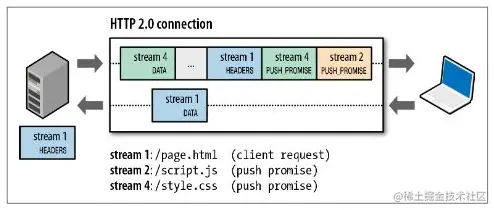

注意两点：

- 推送遵循同源策略；

- 这种服务端的推送是基于客户端的请求响应来确定的。

当服务端需要主动推送某个资源时，便会发送一个 Frame Type 为 PUSH_PROMISE 的 Frame，里面带了 PUSH 需要新建的 Stream ID。意思是告诉客户端：接下来我要用这个 ID 向你发送东西，客户端准备好接着。客户端解析 Frame 时，发现它是一个 PUSH_PROMISE 类型，便会准备接收服务端要推送的流。

## WebSocket 协议

